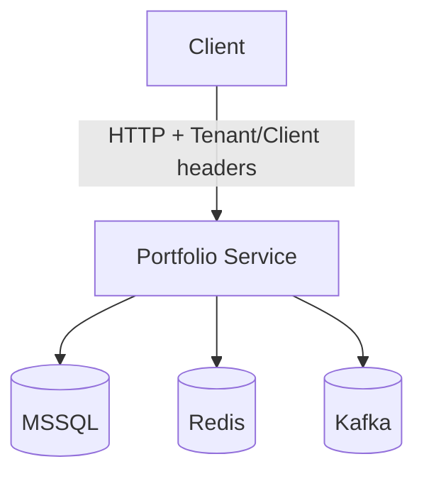
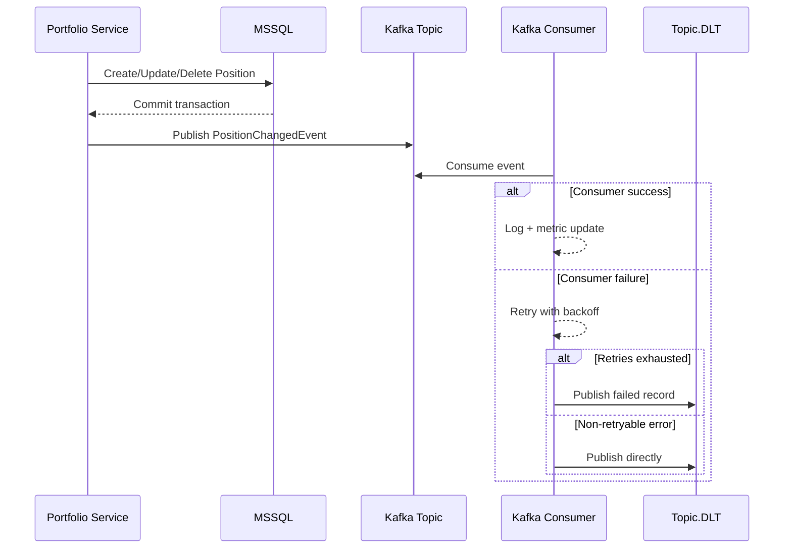

# Portfolio Position Service (Spring Boot + Redis + Kafka + Grafana + Sentry)

A backend service for managing portfolio positions with CRUD operations, Redis caching, rate limiting, and Kafka event flow.

The project keeps core backend patterns explicit and practical:
- cache-aside reads
- cache invalidation on writes
- Redis locking for cache rebuild protection
- Redis rate limiting
- Kafka publish/consume for position change events

## What this service does

It manages `Position` records:
- `clientId` (portfolio owner)
- `symbol` (e.g., MSFT, AAPL)
- `quantity`
- `avgPrice`
- `updatedAt`

## Architecture



## Kafka event flow



## Endpoints

- `POST /positions` -> create a position
- `GET /positions/{id}` -> get position by UUID (Redis cached + rate limited)
- `GET /clients/{clientId}/positions` -> list client positions (cached)
- `PUT /positions/{id}` -> update
- `DELETE /positions/{id}` -> delete

## Key features implemented

- Multi-tenant key namespace via `X-Tenant-Id`
- Cache-aside pattern for reads
- Cache invalidation on write operations
- Stampede protection (cache rebuild lock) using `SET NX EX` + Lua unlock
- Fixed-window rate limiting using Redis script pattern
- TTL jitter to reduce synchronized expirations (thundering herd)
- Binary serialization (Protobuf) for cache payloads (smaller + faster than JSON)
- Kafka event publishing after DB transaction commit
- Kafka consumer with retry/backoff and DLT handling

## Tech stack

- Java 17
- Spring Boot
- Spring Data JPA
- MSSQL
- Spring Data Redis (Lettuce)
- Kafka
- Protobuf (for binary cache encoding)
- Prometheus + Grafana
- Sentry

## Running locally

### 1) Start dependencies

```bash
docker compose up -d
```

### 2) Run the service

```bash
./gradlew bootRun
```

Service runs on:

`http://localhost:8085`

## How to test (curl)

### Create position

```bash
curl -i -X POST "http://localhost:8085/positions" \
  -H "Content-Type: application/json" \
  -H "X-Tenant-Id: t1" \
  -H "X-Client-Id: c1" \
  -d '{
    "clientId": "c1",
    "symbol": "MMD",
    "quantity": 75,
    "avgPrice": 999.12
  }'
```

Copy the `id` from the response.

### Get by id (cached + rate-limited)

```bash
curl -i -H "X-Tenant-Id: t1" -H "X-Client-Id: c1" \
  "http://localhost:8085/positions/<UUID>"
```

### List by client (cached)

```bash
curl -i -H "X-Tenant-Id: t1" -H "X-Client-Id: c1" \
  "http://localhost:8085/clients/c1/positions"
```

### Update

```bash
curl -i -X PUT "http://localhost:8085/positions/<UUID>" \
  -H "Content-Type: application/json" \
  -H "X-Tenant-Id: t1" \
  -H "X-Client-Id: c1" \
  -d '{
    "symbol": "GHOLY",
    "quantity": 56,
    "avgPrice": 425.10
  }'
```

### Delete

```bash
curl -i -X DELETE -H "X-Tenant-Id: t1" -H "X-Client-Id: c1" \
  "http://localhost:8085/positions/<UUID>"
```

## How to observe Redis behavior

Open `redis-cli` and run:

```bash
MONITOR
```

Then call `GET /positions/{id}` multiple times.

First call:
- Cache MISS
- Acquire Redis lock
- Load from source
- `SET` cache with TTL (+ jitter)
- Release lock

Next calls:
- Cache HIT
- Read directly from Redis
- No lock, no DB call
- Until TTL expires

## How to observe Kafka behavior

1. Perform `POST`, `PUT`, or `DELETE` on positions.
2. Producer publishes `PositionChangedEvent`.
3. Consumer logs the consumed event and increments Kafka metric counters.
4. On repeated consumer failure, message is routed to DLT.

## Project structure

- `api/`  
  Standard API error responses + global exception mapping.

- `config/`  
  Cross-cutting infra config: Jackson time serialization, Redis binary template, tenant/trace filters, Sentry config.

- `controller/`  
  REST endpoints for CRUD operations.

- `domain/`  
  JPA entity (`PortfolioPosition`) stored in DB.

- `dto/`  
  Request/response objects with validation.

- `redis/`  
  Redis concerns:
  - caching (string + binary/proto)
  - locking (stampede protection)
  - rate limiting (script-based)
  - key conventions + TTL jitter

- `kafka/`  
  Event contract + producer + consumer + error handling (retry/DLT).

- `repository/`  
  Spring Data JPA repository.

- `service/`  
  Business logic, caching strategy, invalidation logic.

- `proto/`  
  Protobuf schema used for compact Redis serialization.
